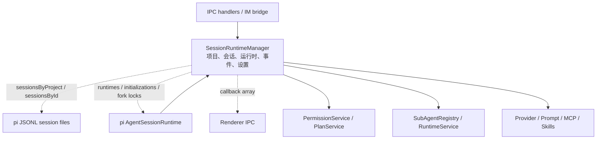
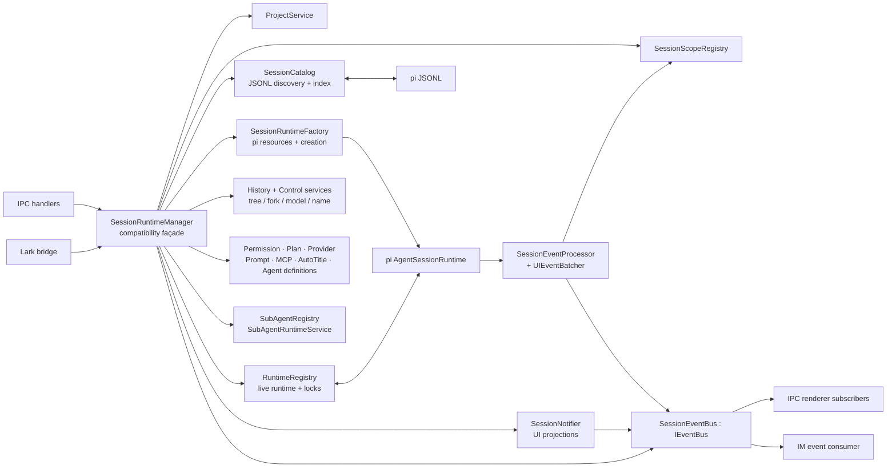
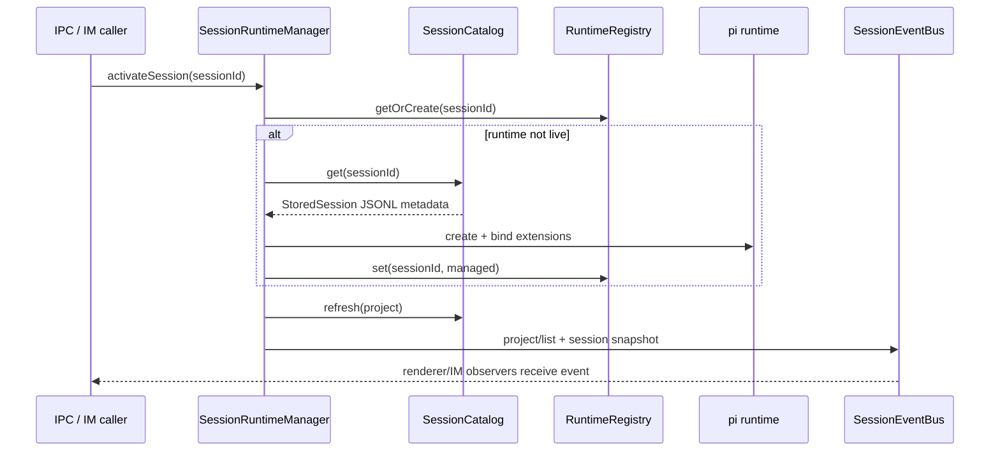
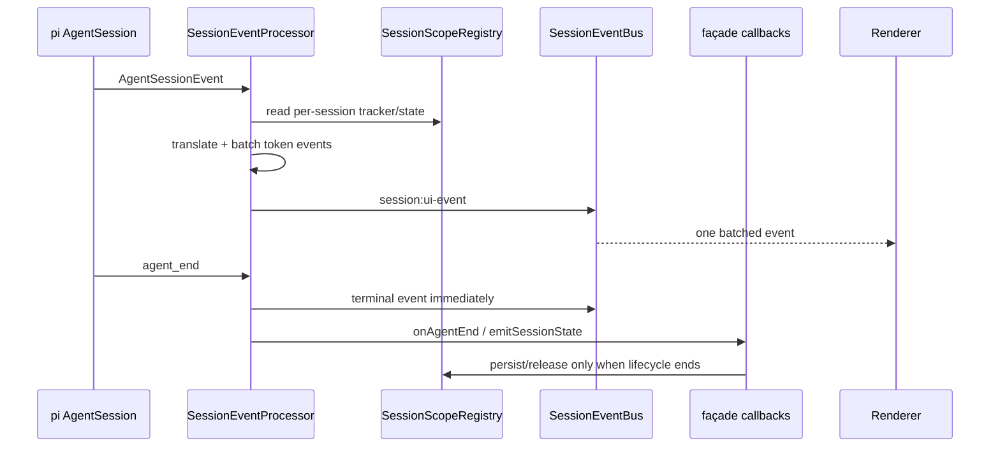

# SessionRuntimeManager 拆分架构

## 目标与结论

本次重构将 `SessionRuntimeManager` 中共享基础设施与投影逻辑进一步拆为独立模块，并保留 `SessionRuntimeManager` 作为兼容 façade：IPC、IM bridge 和现有调用方不需要修改其公开 API。拆分后，持久化会话目录、运行时注册表、事件订阅、AgentInfo 投影、项目创建/信任以及会话创建/销毁/中止不再由 façade 直接实现。

已实现的代码入口：

- [SessionRuntimeManager](../apps/electron/src/main/session/runtime/runtime-manager.ts)：兼容 façade 与跨领域编排。
- [SessionCatalog](../apps/electron/src/main/session/services/session-catalog.ts)：持久化会话发现、索引与子会话元数据恢复。
- [RuntimeRegistry](../apps/electron/src/main/session/runtime/runtime-registry.ts)：运行时身份、并发初始化去重与按会话互斥操作。
- [SessionEventBus](../apps/electron/src/main/session/events/session-event-bus.ts)：主进程到消费者的进程内事件扇出。
- [SessionRuntimeFactory](../apps/electron/src/main/session/runtime/runtime-factory.ts)：cwd-bound pi 服务、资源初始化串行化与 runtime 创建。
- [SessionHistoryService](../apps/electron/src/main/session/services/session-history-service.ts)：树导航、标签和可回滚的 fork 事务。
- [SessionControlService](../apps/electron/src/main/session/services/session-control-service.ts)：模型、思考级别、压缩和名称命令。
- [SessionNotifier](../apps/electron/src/main/session/events/session-notifier.ts)：session 快照、列表、TODO 和 context 使用量的 UI 投影。
- [SessionInfoService](../apps/electron/src/main/session/services/session-info-service.ts)：从 stored session、live runtime、子代理与 IM 绑定构建 renderer 所需的 `AgentInfo`。
- [ProjectRuntimeService](../apps/electron/src/main/session/services/project-runtime-service.ts)：项目创建 onboarding 与信任变更后的 runtime reload。
- [SessionLifecycleService](../apps/electron/src/main/session/services/session-lifecycle-service.ts)：会话创建、销毁与中止的跨服务编排。
- [ProjectDeletionService](../rojects/project-deletion-service.ts)：项目删除的跨领域编排（runtime dispose、文件清理、目录删除、事件发送）。
- [SessionSubagentService](../apps/electron/src/main/session/services/session-subagent-service.ts)：子会话创建、SubAgent 开关与 Agent 定义重载。
- [SessionMessagingService](../apps/electron/src/main/session/services/session-messaging-service.ts)：用户 prompt 发送与 `/agent:name` chip 解析。
- [SessionPermissionOrchestrator](../apps/electron/src/main/session/services/session-permission-orchestrator.ts)：permission/plan 模式切换的跨服务协调。

## 1. 改造前的职责与依赖分析

改造前 `SessionRuntimeManager`（2,105 行）同时承担了以下职责；拆分后降至约 1,300 行，核心领域逻辑已下沉到独立服务：

| 领域 | 具体职责 | 原始耦合问题 |
| --- | --- | --- |
| 项目 | 项目切换、信任、删除与目录清理 | 项目服务、会话文件和运行时处在同一对象内 |
| 会话目录 | 扫描 JSONL、索引 `sessionsByProject`/`sessionsById`、恢复子会话 | 持久化读取和内存运行时生命周期混在一起 |
| 运行时 | `runtimes`、初始化 Promise 去重、fork 锁、bind/rebind/dispose | 并发控制散落在会话业务方法中 |
| pi SDK 资源 | cwd 服务、扩展工厂、资源初始化串行化 | 与会话命令和 UI 状态直接相互依赖 |
| 事件 | SDK 事件翻译、批处理、订阅回调数组、快照推送 | 传输订阅与领域事件处理共享 façade 状态 |
| 代理命令 | 创建、激活、发送、终止、重命名、导航、fork、模型与思考级别 | 调用方必须依赖一个覆盖所有领域的对象 |
| 权限/计划 | 权限模式、持久化与计划交互 | 依赖运行时但不应拥有运行时注册表 |
| 子代理 | 父子关系、执行、超时、清理与 Agent 定义 | 运行时创建与子代理结算交织 |
| 设置/扩展 | 模型 Provider、Prompt、Skill、MCP、自动标题 | 领域服务虽已存在，但入口仍集中 |

改造前的关键依赖关系如下。虚线表示共享可变状态而不是明确接口。



## 2. 拆分后的模块边界

### 模块与公开接口

| 模块 | 单一职责 | 对外接口 | 不负责 |
| --- | --- | --- | --- |
| `SessionCatalog` | 维护已落盘 JSONL 会话的项目列表和 ID 索引；轻量恢复子会话关系 | `refresh(project)`、`replace`、`removeProject`、`get`、`listByProject` | 创建 pi runtime、UI 事件、删除文件 |
| `RuntimeRegistry` | 管理 live runtime 引用、同 session 初始化去重、同 session 互斥任务 | `get/set/delete`、`getOrCreate`、`awaitInitialization`、`withExclusive` | 创建/销毁 SDK runtime、业务策略、发送事件 |
| `SessionEventBus` | 在同一主进程内安全分发 `MainToRendererEvent` | `onEvent`、`emit`、`clear` | Electron 窗口管理、事件翻译、会话状态 |
| `SessionRuntimeFactory` | 创建 cwd-bound pi services/runtime，串行化资源初始化，注入 extension factories 和 trust resolver | `create(cwd, sessionManager, startEvent, options)` | runtime 注册、bind/rebind、UI 通知 |
| `SessionHistoryService` | 运行 session tree 导航、标签更新、fork 的校验/清理事务 | `navigate`、`setEntryLabel`、`fork` | 项目索引、runtime 注册表细节、renderer 传输 |
| `SessionControlService` | 变更模型、thinking、压缩与命名 | `setModel`、`setThinkingLevel`、`compress`、`rename` | prompt 传输、权限策略、session 扫描 |
| `SessionNotifier` | 把 session/runtime 查询结果投影为 renderer event，并管理 context usage 节流 | `emitSessionState`、`emitSessionUpdated`、`emitSessionList` 等 | runtime 状态变更、Electron 窗口、订阅存储 |
| `SessionInfoService` | 构建 renderer 所需的 `AgentInfo`：stored/live runtime、子代理、IM 绑定与流状态 | `listAgents`、`listAgentsInProject`、`getAgentInfo`、`getManagedRuntime` | 直接修改 runtime/session 状态 |
| `ProjectRuntimeService` | 项目 onboarding（目录校验、去重、目录替换）与信任变更后的 runtime reload | `createProject`、`setProjectTrust` | 激活项目后的 UI 刷新、trust 决策 |
| `SessionLifecycleService` | 会话创建、销毁、中止的跨服务编排 | `createAgent`、`destroyAgent`、`abortAgent` | runtime 底层 bind/rebind、持久化索引细节 |
| `SessionScopeRegistry` | 持有严格 per-session 的流状态、批处理缓冲、标题门控和 IM 来源 | `acquire/get/release` | 跨会话索引、JSONL 读写 |
| `SessionEventProcessor` + `UIEventBatcher` | 将 pi SDK 事件转换、批量发送，并将副作用回调给 host | `handle`、`dispose` | 直接持有 runtime registry 或项目目录 |
| `ProjectService` | 项目索引、持久化、信任状态 | 项目 CRUD 与 trust 查询 | 会话扫描和 runtime 生命周期 |
| `SubAgentRegistry` + `SubAgentRuntimeService` | 父子关系、执行结算、超时、延迟释放 | 注册/查询、tracking、finalize、级联操作 | 创建子会话的业务入口 |
| `ModelProviderService`、`PermissionService`、`PlanService`、`AutoTitleService`、`AgentDefinitionService` | 各自领域规则 | 各服务的领域方法 | 会话注册表的内部数据结构 |
| `SessionRuntimeManager` | 保持旧 API、协调跨领域业务事务 | 现有 IPC/IM 使用的所有方法 | 不再拥有上述三种基础设施的状态细节 |

### 依赖和通信规则

1. 持久化会话只能通过 `SessionCatalog` 查询和更新索引；业务模块不得自行维护第二份 session Map。
2. live `AgentSessionRuntime` 只能通过 `RuntimeRegistry` 读取和登记；`SessionRuntimeFactory` 只创建 runtime，绝不登记 runtime。相同 session 的初始化必须走 `getOrCreate`，fork 冲突操作必须走 `withExclusive`。
3. 树和控制命令分别走 `SessionHistoryService` 与 `SessionControlService`；它们通过窄 host interface 调用 lifecycle，而不依赖 façade 实现。
4. UI/IM 观察事件只订阅 `IEventBus`。`SessionNotifier` 负责 event payload 投影，模块不得保存 renderer callback 数组，也不得直接触碰 Electron `webContents`。
5. pi SDK 原始事件只进入 `SessionEventProcessor`；其副作用仅通过 `ISessionEventHost` 回调，避免处理器依赖 façade 的内部字段。
6. `SessionScopeRegistry` 的 acquire/release 与 runtime bind/dispose 成对执行。session ID rebind 时必须释放旧 scope、创建新 scope。
7. 所有领域服务仅依赖 [core contracts](../ore/contracts.ts) 或窄 host 接口；禁止从领域服务反向 import `SessionRuntimeManager`。现存 IM/IPC 对 façade 的依赖是兼容边界，而不是服务内部依赖。

### 目标架构图



## 3. 典型调用流程

### 激活历史会话



### 流式事件与结束后的刷新



## 4. 实施迁移计划

迁移采用并行可回滚的 strangler 模式，而不是修改 IPC 协议或重写 pi JSONL。

| 阶段 | 变更 | 保护措施 | 完成状态 |
| --- | --- | --- | --- |
| 0. 建基线 | 记录公开 API、JSONL 格式、现有测试与事件序列 | 只读扫描；不迁移持久化数据 | 完成 |
| 1. 纯服务提取 | 既有 `ProjectService`、事件处理器、scope、子代理/模型/权限服务独立 | 服务只接收窄接口 | 已存在并持续使用 |
| 2. 目录拆分 | 使用 `SessionCatalog` 替换 `sessionsByProject`/`sessionsById` 和子会话 JSONL 轻扫 | `replace` 保留测试和恢复路径；不改变 JSONL schema | 完成 |
| 3. runtime 拆分 | 使用 `RuntimeRegistry` 替换 runtime Map、初始化 Promise、fork lock | 同 ID 去重和排他锁单测；bind/rebind/dispose 顺序不变 | 完成 |
| 4. 事件拆分 | 使用 `SessionEventBus` 替换 façade callback 数组 | 保持 `onEvent/emit` 方法签名；自注销时使用分发快照 | 完成 |
| 5. 渐进下沉 | `SessionRuntimeFactory`、`SessionHistoryService`、`SessionControlService` 已下沉；新增 `ProjectDeletionService`、`SessionSubagentService`、`SessionMessagingService`、`SessionPermissionOrchestrator` | 每次仅迁移一个命令组，保留 façade 委托 | 完成 |
| 6. 收尾 | IPC 按领域拆分为 `apps/electron/src/main/ipc/routers/*`；清理 façade 内部 subagent 适配方法 | `handlers.ts` 仅保留注册入口；端到端回归通过 | 完成 |
| 7. 进一步下沉 | `SessionInfoService` 接管 `AgentInfo` 投影；`ProjectRuntimeService` 接管项目创建/信任；`SessionLifecycleService` 接管创建/销毁/中止 | façade 仅保留委托；相关测试更新 | 完成 |

### 发布与回滚方案

1. 本变更不写入新 JSONL 条目、不修改 session ID、不改变 IPC channel 或 payload，因此可以按常规桌面版本回退。
2. 发现目录恢复异常时，回滚到上一个应用构建即可；原有 `~/.look/workspaces/**/sessions/*.jsonl` 不受影响。
3. 发现 runtime 初始化卡住时，日志中按 session ID 检查 `RuntimeRegistry.getOrCreate`；回滚版本会重新使用内嵌 Map，已存在的 runtime 文件仍可打开。
4. 发布采用 canary：新建、恢复、fork、子代理、权限/计划、项目删除各执行一次冒烟；观察 `error`、`session:snapshot`、`agent:list` 事件。

## 5. 风险评估

| 风险 | 等级 | 缓解与验收 |
| --- | --- | --- |
| 同一 session 并发初始化生成两个 runtime | 高 | `getOrCreate` 复用同一个 Promise；单元测试断言 create 只执行一次 |
| fork 与删除/切换并发造成 session 状态错位 | 高 | `withExclusive(sessionId)` 串行化 fork；dispose 会释放锁引用 |
| 子会话在启动恢复时丢失父子关系 | 中 | `SessionCatalog.refresh` 轻扫 custom JSONL entry 并回调注册；集成测试覆盖 |
| 订阅回调自注销导致漏发/迭代失效 | 中 | `SessionEventBus` 在 emit 时复制订阅快照；单元测试覆盖 |
| 目录扫描时删除文件抛出异常 | 中 | 单个文件和目录读取均降级为跳过，不影响其余 session |
| 外部调用方依赖私有 Map | 低 | 生产调用方始终走 façade API；测试改为使用新模块的受控 seam |

## 6. 测试设计与结果

| 类型 | 覆盖内容 | 用例 |
| --- | --- | --- |
| 单元 | `SessionEventBus` 的订阅、退订、自退订时的快照分发 | [session-event-bus.test.ts](../on-event-bus.test.ts) |
| 单元 | `RuntimeRegistry` 的并发初始化去重和排他队列 | [runtime-registry.test.ts](../me-registry.test.ts) |
| 单元/SDK 集成 | `SessionRuntimeFactory` 的 cwd-bound pi runtime 创建与 extension 注入边界 | [runtime-factory.test.ts](../me-factory.test.ts) |
| 单元 | `SessionHistoryService` 的导航、标签更新、streaming fork 拒绝 | [session-history-service.test.ts](../on-history-service.test.ts) |
| 单元 | `SessionControlService` 的模型校验/变更、命名、压缩保护 | [session-control-service.test.ts](../on-control-service.test.ts) |
| 单元 | `SessionNotifier` 的 context 节流和通过 event bus 的 UI 投影 | [session-notifier.test.ts](../on-notifier.test.ts) |
| 单元 | `SessionInfoService` 的 AgentInfo 投影构建 | 由 `session-notifier.test.ts` 与回归测试覆盖；新增服务自身无状态 |
| 单元 | `ProjectRuntimeService` 的项目创建 onboarding 与信任变更 reload | [project-runtime-service.test.ts](../ct-runtime-service.test.ts) |
| 单元 | `SessionLifecycleService` 的创建/销毁/中止编排 | [session-lifecycle-service.test.ts](../on-lifecycle-service.test.ts) |
| 单元 | `SessionCatalog` 的项目索引和 JSONL 子会话元数据解析 | [session-catalog.test.ts](../on-catalog.test.ts) |
| 集成 | `SessionCatalog.refresh` → `SubAgentRegistry`：恢复顶层/子会话并建立父子链接 | [session-infrastructure.integration.test.ts](../on-infrastructure.integration.test.ts) |
| 回归 | 使用新注册表 seam 的子代理开关、子会话删除与项目删除 | [subagent-toggle.test.ts](../ent-toggle.test.ts)、[subagent-delete.test.ts](../ent-delete.test.ts) |
| 单元 | `ProjectDeletionService` 的项目删除编排 | [project-deletion-service.test.ts](../ct-deletion-service.test.ts) |
| 单元 | `SessionSubagentService` 的默认开关、递归深度保护与 runSubSession | [session-subagent-service.test.ts](../on-subagent-service.test.ts) |
| 单元 | `SessionMessagingService` 的 prompt 发送与 `/agent:name` chip 解析 | [session-messaging-service.test.ts](../on-messaging-service.test.ts) |
| 单元 | `SessionPermissionOrchestrator` 的模式切换与 no-op 路径 | [session-permission-orchestrator.test.ts](../on-permission-orchestrator.test.ts) |
| 结构 | IPC handler 已按领域拆分为 router 文件 | [ipc-router-structure.test.ts](../outer-structure.test.ts) |

验收命令：

```bash
npm run test --workspace=@look/electron -- session subagent pi-runtime-alignment project-deletion-service project-runtime-service session-permission-orchestrator session-messaging-service session-subagent-service ipc-router-structure
npm run build:main
```

## 7. 可维护性准则

- 新增持久化会话字段：优先扩展 `StoredSession`/`SessionCatalog`，不要在 façade 中新增平行 Map。
- 新增 runtime 级状态：优先加入 `SessionScope`；只有 runtime 身份和并发协调才能进入 `RuntimeRegistry`。
- 新增主进程通知：发布 `MainToRendererEvent` 到 `IEventBus`，不向业务服务注入 BrowserWindow。
- 新增跨领域命令：先定义窄 host interface，再由 façade 适配；避免服务获取完整 `SessionRuntimeManager`。
- 保持 AGENTS.md 的约束：一个 session ID 至多一个 live runtime；cwd/project ID 在 runtime 生命周期内不可变；切换 renderer 选择不得中止其他会话。
